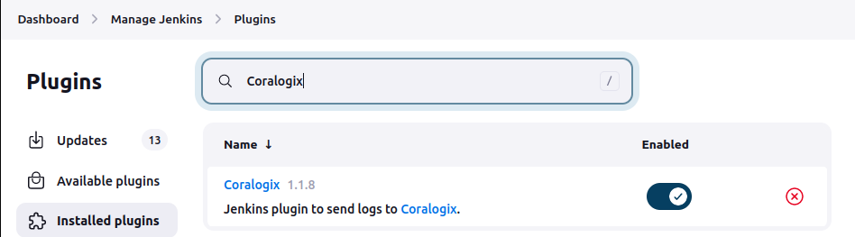

# Jenkins Coralogix Plugin

This plugin adds support for sending the job's console logs, metrics and
push tags to [Coralogix](https://coralogix.com/).

## Installation

* Download the hpi file from GitHub releases

* Put the ``hpi`` file in the directory ``$JENKINS_HOME/plugins``

* Restart Jenkins



## Configuration

Go to ``Manage Jenkins``, open ``Configure system``,
find ``Coralogix`` section and configure your account private key
for sending system/audit/security logs and metrics:


Also, if you use different Coralogix Region, you can change it
as ``Coralogix Region`` under the ``Advanced...`` section.

Or if you use Private Link you can change ``Coralogix Region`` to *Custom* and overwrite it in ``Custom Coralogix endpoint`` field.

## Credentials

Before usage you need to create ``Jenkins`` credentials with
``Coralogix`` **Private Key** for your team:


and **API Key** to push tags:


## Usage

This plugin provides sending build logs and tags pushing
both for ``Freestyle project`` and ``Pipelines``.

### Send logs

Send your build logs to Coralogix.

#### Freestyle project

Just check the ``Send build logs to Coralogix``,
select ``Private Key`` and provide ``Application name``:


#### Pipeline

This is the ``Groovy`` implementation:

```groovy
pipeline {
    agent any
    stages {
        stage('Test') {
            steps {
                echo "Hello world!"
            }
        }
    }
    post {
        always {
            coralogixSend privateKeyCredentialId: 'coralogix-production',
                          application: 'MyApp',
                          subsystem: "${env.JOB_NAME}",
                          splitLogs: true
        }
    }
}
```

### Send metrics

Send your pipelines metrics to Coralogix.

#### Pipeline

This is the ``Groovy`` implementation:

```groovy
pipeline {
    agent any
    stages {
        stage('Test') {
            steps {
                echo "Hello world!"
            }
        }
    }
    post {
        always {
            coralogixMetricsSend privateKeyCredentialId: 'coralogix-production',
                                 application: 'MyApp',
                                 subsystem: "${env.JOB_NAME}",
                                 splitStages: false
        }
    }
}
```

### Push tag

Push version tag to Coralogix.

#### Freestyle project

Add build step ``Push Coralogix tag`` and configure:

* **API Key** - your Coralogix account API key
* **Tag name** - version tag name
* **Application names** - your application names
* **Subsystem names** - your subsystem names
* **Icon**(optional) - your own tag picture


#### Pipeline

This is the ``Groovy`` representation of ``Push Coralogix tag`` build step:

```groovy
pipeline {
    agent any
    stages {
        stage('Test') {
            steps {
                echo "Hello world!"
            }
        }
    }
    post {
        success {
            coralogixTag apiKeyCredentialId: 'coralogix-production-api',
                         tag: '1.0.0',
                         applications: [
                            [name: 'MyApp']
                         ],
                         subsystems: [
                            [name: 'staging'],
                            [name: 'production']
                         ],
                         icon: 'https://raw.githubusercontent.com/coralogix/jenkins-coralogix-plugin/master/docs/images/logo.svg'
        }
    }
}
```

## License

The Coralogix Plugin is licensed under the Apache 2.0 License.